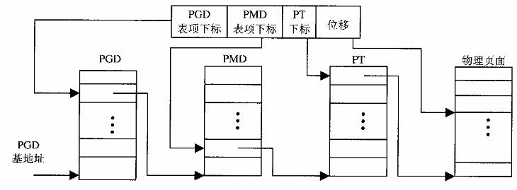

# 存储管理

## Linux 内存管理框架

通过页面目录和页面表分为2个层次实现线性地址到物理地址的映射。但这类设计只能针对32位操作系统，因为每个页面大小为4k。

于是针对当前情况，linux设计了3层结构：PGD,PMD,PT。
而PTE是page table entry，表项结构体。PT是PTE的大数组，PMD和PGD则是PT的映射表。

虚拟Linux内存管理通过四部完成地址转换：
1. 用线性地址的最高一个位段从PGD找到对应PMD表项
2. 第二个位段从PMD中找到对应PT表项
3. 第三个位段从PT中找到对应的PTE，指向物理页面的指针
4. 线性地址中最后位段为相对偏移量

这其中有个重点问题，在cpu和mmu的机制中，只存在2层模型，所以需要将三层映射支持两层结构中。同时在后期Intel中引入了PAE扩充功能，允许地址宽度提高至36位，在硬件方面支持了三层映射模型。

三层模型支持两层模型流程：
1. 内核为MMU设置好映射的PGD，通过位段找到对应的中间目录
2. 而PMD设置为0，所以PGD直接映射到PT中。
3. MMU找到PT目录中找到对应的PTE
4. 最终和偏移量进行组合得到物理地址

## 地址映射过程

## 重要数据结构、函数

## 越界访问

## 用户堆栈管理

## 物理内存的使用和周转

## 页面的周转

## 内存缓冲区的管理

## 外部设备的地址映射

## 系统调用-brk和mmap
