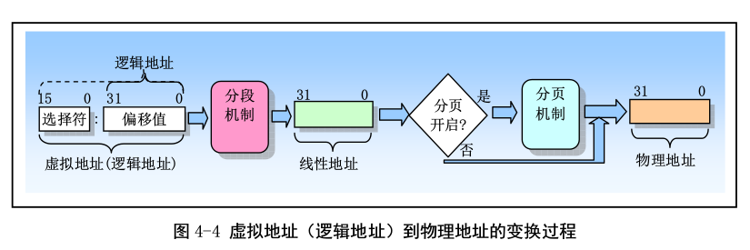
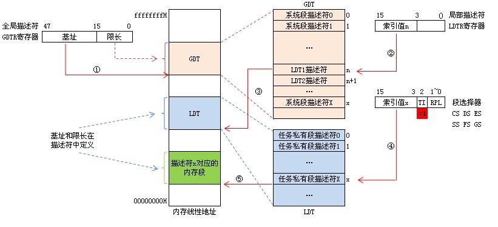
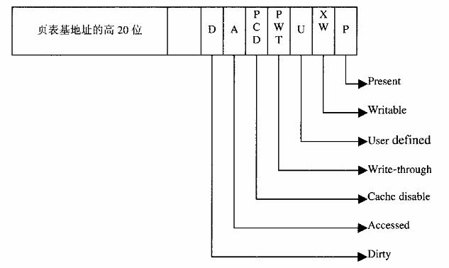

# 存储管理

## Linux 内存管理框架

通过页面目录和页面表分为2个层次实现线性地址到物理地址的映射。但这类设计只能针对32位操作系统，因为每个页面大小为4k。

于是针对当前情况，linux设计了3层结构：PGD,PMD,PT。
而PTE是page table entry，表项结构体。PT是PTE的大数组，PMD和PGD则是PT的映射表。

```
typedef struct {
unsigned int ptba:20; /* 页表基地址的高20位  */
unsigned int avail:3; /*   */
unsigned int g:1; /* 是否为全局性页面  */
unsigned int ps:1; /* 页面大小  */
unsigned int reserved:1; /*   */
unsigned int a:1; /* 已经被访问过  */
unsigned int pcd:1; /* 关闭缓冲存储器  */
unsigned int pwt:1; /* 用于缓冲存储器  */
unsigned int u_s:1; /* 用户权限还是系统权限  */
unsigned int r_w:1; /* 只读或可写  */
unsigned int p:1; /* 0表示不在内存中  */
}
```


虚拟Linux内存管理通过四部完成地址转换：
1. 用线性地址的最高一个位段从PGD找到对应PMD表项
2. 第二个位段从PMD中找到对应PT表项
3. 第三个位段从PT中找到对应的PTE，指向物理页面的指针
4. 线性地址中最后位段为相对偏移量

这其中有个重点问题，在cpu和mmu的机制中，只存在2层模型，所以需要将三层映射支持两层结构中。同时在后期Intel中引入了PAE扩充功能，允许地址宽度提高至36位，在硬件方面支持了三层映射模型。

三层模型支持两层模型流程：
1. 内核为MMU设置好映射的PGD，通过位段找到对应的中间目录
2. 而PMD设置为0，所以PGD直接映射到PT中。
3. MMU找到PT目录中找到对应的PTE
4. 最终和偏移量进行组合得到物理地址



GDT和LDT，2者名字分别为全局段描述符和局部段描述符。

GDT的容量有多大？GDT位段总共13位，共计8192个描述项，而每个进程存在2个表项，所以，理论上系统最大进程数为4090

然后，每个描述表项含有段的基地址和段的大小，再加上其他一些信息，共计8个字节。
```
typedef struct {
 unsigned int base24_31:8; /* 基地址的高8位 */
 unsigned int g:1;  
 unsigned int d_b:1;  
 unsigned int unused:1; 
 unsigned int avl:1;    
 unsigned int seg_limit_16_19:4;     /* 段长度的高4位 */
 unsigned int p:1;  
 unsigned int dpl:2;  
 unsigned int s:1;  
 unsigned int type:4; 
 unsigned int base_0_23:24; /* 基地址的低24位 */
 unsigned int seg_limit_0_15:16; /* 段长度的低16位 */
} 
```

所以每个描述符包含了32位的地址。

在Linux中，所有地址映射都使用GDT，最后2个位段标识权限，倒数第三个位段标识是否为GDT。

段描述符表分为三类：全局描述符表GDT，局部描述符表LDT和中断描述符表IDT

当 TI=0时表示段描述符在GDT中，如下图所示：
1. 先从GDTR寄存器中获得GDT基址。
2. 然后再GDT中以段选择符高13位位置索引值得到段描述符。
3. 段描述符符包含段的基址、限长、优先级等各种属性，这就得到了段的起始地址（基址），再以基址加上偏移地址yyyyyyyy才得到最后的线性地址。


当TI=1时表示段描述符在LDT中，如下图所示：
1. 还是先从GDTR寄存器中获得GDT基址。
2. 从LDTR寄存器中获取LDT所在段的位置索引(LDTR高13位)。
3. 以这个位置索引在GDT中得到LDT段描述符从而得到LDT段基址。
4. 用段选择符高13位位置索引值从LDT段中得到段描述符。
5. 段描述符符包含段的基址、限长、优先级等各种属性，这就得到了段的起始地址（基址），再以基址加上偏移地址yyyyyyyy才得到最后的线性地址。



所以，在通过GDT后，会得到逻辑地址，而由于Linux本身将基地址设置为0，所以虚拟地址和逻辑地址是一样的。

获取到逻辑地址后，MMU会通过CR3寄存器获取到PGD的信息，开始页表查询。

MMU最初以10,10,12作为位段，4K为一页，而每个表项是4字节，所以，1024个表项，正好就是4K。



4字节主要存储的是下一个页表的基地址，以及相关页表的描述信息。具体的映射关系如下：
1. 从CR3中取得页面目录的基地址
2. 以线性地址中的dir位段作为下标，获得对应的页表描述项
3. 以线性地址的page位段为下标，得到页面描述项
4. 将页面描述项的页面基地址与线性地址的偏移量相加得到物理地址

为何是使用20位作为基地址？由于2^12正好为4096个字节=4k大小，所以，正好是一个页描述符的基地址。

> 问题一：LDT和GDT的使用？

### 重要数据结构

#### 物理空间管理结构体

在Linux中，mem_map是一个page结构指针，存储了所有的页面结构体数组。同时针对所有页面都划分为了ZONE_DMA和ZONE_NORMAL2个管理区。这个后续再说。

针对每个管理区都有一个数据结构：zone_struct结构体。
首先，每个管理区都存在一组free_area_t队列，按页面大小加以管理，主要是4，8，16... 1024。最大为2的10次方的页面块，每个页面4K，也就是4M字节。

```
typedef struct zone_struct {
    spinlock_t lock;
    unsigned long offset;
    unsigned long free_pages;
    unsigned long inactive_clean_pages;
    unsigned long inactive_dirty_pages;
    unsigned long pages_min, pages_low, pages_high;

    struct list_head inactive_clean_list;
    free_area_t free_area[MAX_ORDER];

    char *name;
    unsigned long size;

    struct pglist_data *zone_pgdat;
    unsigned long zone_start_paddr;
    unsigned long zone_start_mapnr;
    struct page *zone_mem_map;
} zone_t;
```

`offset`表示分区在mem_map的起始页面号，而会存在连续一整块的页面都属于某个管理区。

```
typedef struct free_area_struct {
    struct list_head free_list;
    unsigned int *map;
} free_area_t;
```

为了支持NUMA，Linux在zone_struct结构体上增加了pglist_data结构体。

```
typedef struct pglist_data {
    zone_t node_zones[MAX_NR_ZONES];
    zonelist_t node_zonelists[NR_GFPINDEX];
    
    struct page *node_mem_map;
    unsigned long *valid_addr_bitmap;
    struct bootmem_data *bdata;
    
    unsigned long node_start_paddr;
    unsigned long node_start_mapnr;
    unsigned long node_size;

    int node_id;
    struct pglist_data *node_next;
} pg_data_t;
```

所有的pglist_data结构体，可通过node_next来形成一个单链队列。而每个结构体中的node_mem_map都指向具体节点的page结构数组。node_zones最多也有3个管理区，而每个zone结构体也存在一个zone_pgdat指针指向所属的pglist_data对象。

同时，在pglist_data中设置了node_zonelists数组。

```
typedef struct zonelist_struct {
    zone_t * zones [MAX_NR_ZONES+1]; // NULL delimited
    int gfp_mask;
} zonelist_t;
```

主要关联所有的zone，用于搜索不同的存储节点，表示了分配策略。每个存储节点都存在多个分配策略，大小为0x100（256种）所以要求分配页面时，需要说明采用哪种分配策略。

#### 虚拟空间管理结构体

Linux为每个进程分配了4GB的虚拟空间，其中，用户空间占了3GB。虽然当物理空间不连续的时候还是可以使用页表机制将其映射成连续的虚拟空间，但是实际上使用的时候虚拟空间也不一定是连续的。

所以在Linux内核中还有一个数据结构来管理成块的虚拟空间（include/linux/mm.h）

```
struct vm_area_struct {
    struct mm_struct * vm_mm;

    unsigned long vm_start;
    unsigned long vm_end;

    struct vm_area_struct *vm_next;
    pgprot_t vm_page_prot;
    unsigned long vm_flags;
    short vm_avl_height;

    struct vm_area_struct * vm_avl_left;
    struct vm_area_struct * vm_avl_right;

    struct vm_area_struct *vm_next_share;
    struct vm_area_struct **vm_pprev_share;

    struct vm_operations_struct * vm_ops;
    unsigned long vm_pgoff;
    struct file * vm_file;
    unsigned long vm_raend;
    void * vm_private_data;
};
```
每一个vm_area_struct管理一块连续的虚拟空间（注意：不同进程的虚拟用户空间一般不互相影响），vm_start和vm_end分别表示虚拟空间的开始和结束地址。

vm_next是用来连接统一进程的所有vm_area_struct序列链，是按照高低次序进行连接的。

当一个进程的虚存块划分地较少的时候可以使用链式连接查询，但是如果太多的话这样查询效率会降低，所以在块数较多的时候采用AVL树进行存储，也就是平衡二叉树。vm_area_struct中的vm_avl_height、vm_avl_left和vm_avl_right都是和AVL树有关。

vm_next_share、vm_pprev_share、vm_ops等都和磁盘文件以及内存换出等有关，在以后会说到。

在vm_area_struct开头有一个定义：struct mm_struct *vm_mm这个是表明它属于哪个内存进程的内存管理。

```
struct mm_struct {
    struct vm_area_struct * mmap;
    struct vm_area_struct * mmap_avl;
    struct vm_area_struct * mmap_cache;

    pgd_t * pgd;

    atomic_t mm_users;
    atomic_t mm_count;
    int map_count;
    struct semaphore mmap_sem;
    spinlock_t page_table_lock;

    struct list_head mmlist;
    
    unsigned long start_code, end_code, start_data, end_data;
    unsigned long start_brk, brk, start_stack;
    unsigned long arg_start, arg_end, env_start, env_end;
    unsigned long rss, total_vm, locked_vm;
    unsigned long def_flags;
    unsigned long cpu_vm_mask;
    unsigned long swap_cnt;
    unsigned long swap_address;
    
    mm_context_t context;
};
```

这个结构体是比vm_area_struct更高级的数据结构，每个进程都存在一个mm_struct结构体。在进程控制块task_struct结构体中都有一个指针指向mm_struct对象。

1. mmap用来建立一个虚存空间的单链队列；
2. mmap_avl用来建立虚存空间的AVL树；
3. mmap_cache用来指向最近一次用到的虚存区间结构；
4. pgd用来指向该进程的页目录表；
5. 一个进程的mm_struct可以为多个进程共享，mm_user和mm_count就是用来计数的；
6. map_count用来记录进程有几个虚存空间；
7. mmap_sem和page_table_lock是用来定义P、V操作的信号量。
8. 另外start_code、end_code等就是该进程的代码等起始、结束地址。

针对vm_area_struct的查询和插入都存在一个对应的流程。在查询虚存地址是否命中空间时，会先查询mmap_cache，(命中率高达35%)，若未命中则会通过avl进行定位，若不存在avl，则直接查询mmap链表。

而在插入的流程中，会先将vm_area_struct和mm_struct进行加锁，避免2者被修改。后会检查是否存在avl，若存在，则插入avl树中，同时再插入mmap链表中，最后赋值给mmap_cache。
avl的建立主要会针对vm个数大于32时触发。

### 越界访问

越界访问主要存在3种情况：
1. 访问的页面从未建立过，页表项为空
2. 访问的页面不在内存中
3. 访问的页面与权限不符，写入数据至只读页面


## 地址映射过程

## 重要数据结构、函数

## 越界访问

## 用户堆栈管理

## 物理内存的使用和周转

## 页面的周转

## 内存缓冲区的管理

## 外部设备的地址映射

## 系统调用-brk和mmap


## 相关链接
1. [PAE 分页模式详解](https://www.cnblogs.com/ck1020/p/6078214.html)