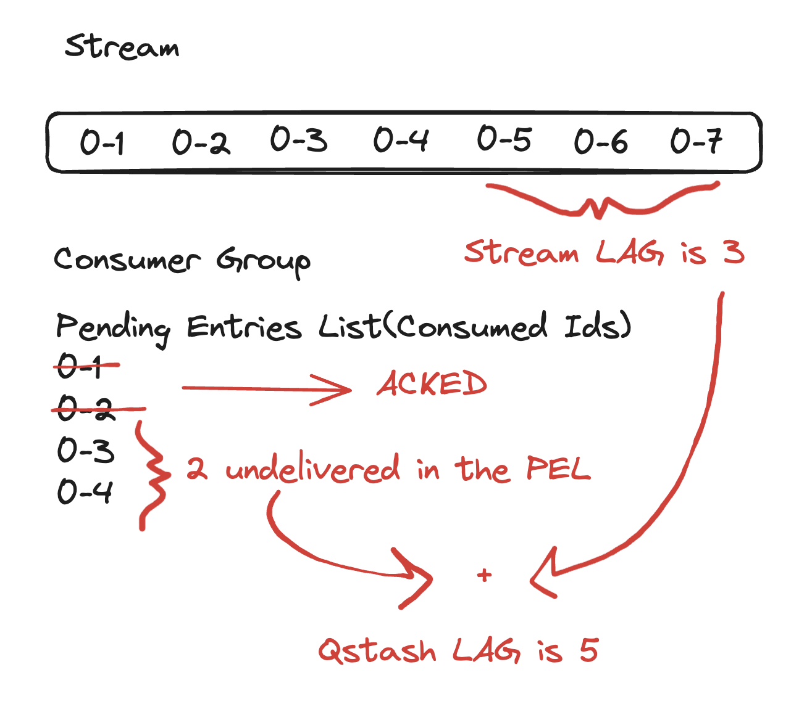

# 0. 前言

在 [[BUG] Stream lag value could be incorrect · Issue #641 · valkey-io/valkey](https://github.com/valkey-io/valkey/issues/641) 这个Issue中，反映了俩个字段的错误情况。

# 1. Issue简介

# 2. 字段原理

# Other documents
[Redis Get Your S\* Together | Upstash Blog](https://upstash.com/blog/redis-stream-together)